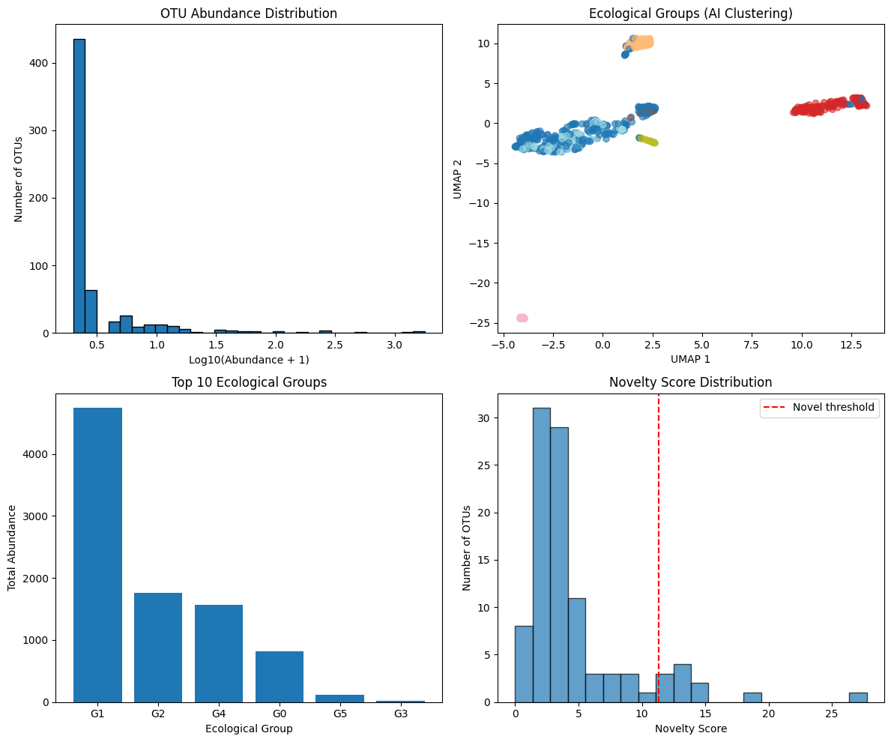

# 🧬 AI-Driven Biodiversity Assessment from eDNA Data

This repository contains an end-to-end bioinformatics pipeline that uses unsupervised deep learning to analyze environmental DNA (eDNA) from deep-sea samples. The primary goal is to assess biodiversity, discover novel ecological groups, and identify potential new taxa directly from raw sequencing reads, minimizing the reliance on traditional reference databases.

## The Challenge: The Unseen Majority in the Deep Sea

The deep ocean is a vast reservoir of undiscovered biodiversity. While eDNA offers a powerful, non-invasive window into these ecosystems, its analysis is severely hampered by a critical bottleneck: the lack of comprehensive reference databases for deep-sea organisms.

<b>Click to expand the full problem statement</b>

> ### Title: Identifying Taxonomy and Assessing Biodiversity from eDNA Datasets
>
> #### Background
> The deep ocean, encompassing vast and remote ecosystems like abyssal plains, hydrothermal vents, and seamounts, harbors a significant portion of global biodiversity, much of which remains undiscovered due to its inaccessibility. Understanding deep-sea biodiversity is critical for elucidating ecological interactions (e.g., food webs, nutrient cycling), informing conservation strategies for vulnerable marine habitats, and identifying novel eukaryotic species with potential biotechnological or ecological significance.
>
> Environmental DNA (eDNA) has emerged as a powerful, non-invasive tool for studying these ecosystems... offering insights into species richness and community structure.
>
> #### Description
> The Centre for Marine Living Resources and Ecology (CMLRE) will undertake routine voyages to the deep sea and collect sediment and water samples for biodiversity assessment...
>
> However, assigning raw eDNA sequencing reads to eukaryotic taxa or inferring their ecological roles presents significant challenges, primarily due to the poor representation of deep-sea organisms in reference databases like SILVA, PR2, or NCBI... This dependency limits the discovery of new species and hinders accurate biodiversity assessments...
>
> #### Expected Solution
> To address the challenges of poor database representation and computational time in deep-sea eDNA analysis, we propose an AI-driven pipeline that uses deep learning and unsupervised learning to identify eukaryotic taxa and assess biodiversity directly from raw eDNA reads. The solution should be able to classify the sequences, annotate and estimate abundance. This solution minimizes reliance on reference databases, reduces computational time through optimized workflows, and enables the discovery of novel taxa and ecological insights in deep-sea ecosystems.

---

## 🤖 Our Solution: An AI-Driven Pipeline

This pipeline processes raw `.fastq` files and uses a series of data-driven steps to move from raw sequences to ecological insights.

*(Suggestion: Add your final report screenshot to the repo and name it `final_report.png`)*

### The Workflow

1.  **OTU Clustering (VSEARCH):** Raw sequences are clustered into Operational Taxonomic Units (OTUs) at 97% sequence identity. This step quantifies the "species richness" of the sample and calculates the abundance of each OTU.

2.  **Data Vectorization (K-mer Tokenization):** The representative DNA sequence of each OTU is converted into a numerical vector. This is done by counting the frequency of all possible 6-mers (6-base-pair "DNA words"), transforming biological sequences into a mathematical format suitable for AI.

3.  **Representation Learning (Variational Autoencoder - VAE):** A deep learning model (VAE) is trained to compress the high-dimensional k-mer vectors (4096 features) into a dense, low-dimensional "embeddin
